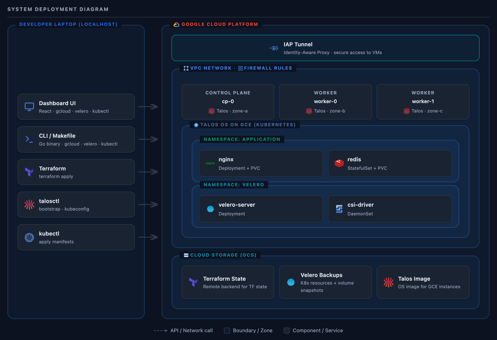

# Kubernetes Lab

A hands-on lab for running self-managed Kubernetes clusters on cloud VMs. Not managed Kubernetes (GKE, EKS, AKS) - you control the full stack from VMs to workloads.

## Goals

- **Learn Talos Linux**: Immutable, API-driven Kubernetes OS
- **Learn Velero**: Backup and restore Kubernetes workloads
- **Reproducibility**: Destroy and recreate clusters from scratch in minutes
- **Multi-cloud**: Same platform layer across different cloud providers

## Current Status

| Phase | Status |
|-------|--------|
| Foundation (Terraform, automation) | Complete |
| Cluster (Talos Linux, Kubernetes) | Complete |
| Backup (Velero) | Complete |
| Applications (Stateful workloads) | Complete |
| Web Dashboard | Complete |
| AI Agents (Unified Commerce Platform) | In Progress |
| Multi-cloud expansion | Planned |

### Supported Platforms

| Cloud | Compute | Status |
|-------|---------|--------|
| GCP | GCE | Supported |

## Architecture

### System Deployment



*Interactive diagrams with detailed C4 context, container, and layered architecture views available in the [Web Dashboard Architecture page](https://raw.githack.com/berkaybuharali/k8s-lab/main/ui/frontend/public/architecture.html).*

### Layered Architecture

| Layer | Components | Cloud-Specific |
|-------|------------|----------------|
| **4. Applications** | NGINX, Redis, User workloads | Cloud-agnostic |
| **3. Platform Tools** | Velero, CSI Driver | Cloud-agnostic |
| **2. Cluster** | Talos Linux, Kubernetes | Cloud-specific |
| **1. Infrastructure** | VMs, VPC, Firewall, Storage | Cloud-specific |

Layers 3-4 are portable across cloud providers. Layers 1-2 require cloud-specific configuration.

## Prerequisites

**Required tools:** See [infra/README.md](infra/README.md#prerequisites)

**Platform setup:** [GCP setup guide](infra/README.md#gcp-setup) (authentication, permissions, Talos image)

---

## Quick Start

### Installing the CLI

**Option 1: Standard Go install (for Go developers)**
```bash
go install ./cli
# Binary installed to ~/go/bin/k8s-lab
```

**Option 2: Manual install (for general users)**
```bash
cd cli && go build -o ../bin/k8s-lab .
mkdir -p ~/.local/bin
cp ../bin/k8s-lab ~/.local/bin/
```

**Add to PATH (one-time setup):**
```bash
# For ~/.local/bin
echo 'export PATH="$HOME/.local/bin:$PATH"' >> ~/.zshrc
source ~/.zshrc

# For ~/go/bin (if using go install)
echo 'export PATH="$HOME/go/bin:$PATH"' >> ~/.zshrc
source ~/.zshrc
```

**Verify installation:**
```bash
k8s-lab --help
```

### All-in-One Deployment

```bash
k8s-lab deploy --cloud gcp     # Infrastructure + tools + applications
k8s-lab destroy --cloud gcp    # Destroy all resources
```

### Step-by-Step Deployment

```bash
# 1. Create infrastructure and bootstrap Kubernetes cluster
k8s-lab deploy-infra --cloud gcp

# 2. Deploy cluster tools (CSI driver, StorageClass, Velero)
k8s-lab deploy-tools --cloud gcp

# 3. Deploy applications (NGINX, Redis)
k8s-lab deploy-applications --cloud gcp

# 4. Test the deployment
export KUBECONFIG=configs/talos/kubeconfig

kubectl get pods -n application

kubectl exec -it deploy/redis -n application -- redis-cli ping
# Should return: PONG

kubectl port-forward svc/nginx -n application 8080:80 &
curl http://localhost:8080
# Should return: NGINX welcome page

# 5. Clean up
k8s-lab destroy --cloud gcp
```

### Backup and Restore Workflow

```bash
# Day 1: Deploy, seed data, backup
k8s-lab deploy --cloud gcp
k8s-lab seed-redis --cloud gcp
k8s-lab backup --cloud gcp
k8s-lab destroy --cloud gcp

# Day 2+: Restore from backup
k8s-lab deploy-infra --cloud gcp
k8s-lab restore --cloud gcp
# Or restore specific backup: k8s-lab restore --cloud gcp --backup <name>

# Verify restored data
export KUBECONFIG=configs/talos/kubeconfig
kubectl exec -it deploy/redis -n application -- redis-cli GET user:1
# Should return seeded data

kubectl get backup -n velero
```

**Flags:**
- `--verbose, -v`: Enable detailed logging
- `--backup <name>`: Specify backup name for restore (default: latest)
- `--clean`: Delete namespace before restore (default: true)

**Backup Hooks:** Redis uses pod annotations for backup hooks (apps/redis.yaml:40-45). For centralized hooks with label selectors, see configs/velero/backup-hooks.yaml.example (Redis + PostgreSQL examples).

---

## Quick Start: Web Dashboard

A browser-based alternative to the terminal. All CLI operations available visually with real-time log streaming, resource inspection, and Velero backup management.

**Additional prerequisites:** Node.js 18+ and npm 9+ (build-time only, not needed at runtime).

```bash
# macOS
brew install node

# Or via nvm (any platform)
curl -o- https://raw.githubusercontent.com/nvm-sh/nvm/v0.40.0/install.sh | bash
nvm install 18
```

### Build and Run

```bash
# 1. Install frontend dependencies (one-time)
cd ui/frontend && npm install && cd ../..

# 2. Build frontend + Go binary
./build-ui.sh

# 3. Start the dashboard
./bin/k8s-lab ui --cloud gcp
# Opens http://localhost:3000 in your browser automatically

# Custom port
./bin/k8s-lab ui --cloud gcp --port 8080
```

From the dashboard you can deploy/destroy infrastructure, watch real-time operation logs, inspect nodes/pods/PVCs, manage Velero backups (create, restore, delete), browse Redis keys, and view Terraform resources.

`Ctrl+C` to stop. Tunnel and server shut down gracefully.

See [ui/README.md](ui/README.md) for development workflow (hot-reload) and API reference.

## Repository Structure

```
k8s-lab/
├── cli/                      # Go CLI
│   ├── cmd/                  # Cobra commands (deploy-infra, backup, restore, ui, etc.)
│   ├── pkg/                  # Packages (cloud, k8s, terraform, velero, logger, ui)
│   └── main.go               # Entry point
├── ui/                       # Web dashboard
│   └── frontend/             # React app (built and embedded into Go binary)
├── apps/                     # Kubernetes manifests
│   ├── gcp/                  # GCP-specific (StorageClass)
│   ├── nginx.yaml            # NGINX deployment
│   └── redis.yaml            # Redis deployment with PVC and backup hooks
├── infra/                    # Cloud infrastructure
│   └── gcp/
│       ├── talos-patches/    # Talos machine config patches
│       └── terraform/        # Terraform definitions
├── configs/                  # Configuration files
│   ├── velero/               # Velero centralized hooks (opt-in)
│   └── talos/                # Generated Talos/K8s configs (gitignored)
├── build-ui.sh               # Build frontend + Go binary
└── CLAUDE.md                 # Project policies and roadmap
```

## Tech Stack

| Component | Technology | Purpose |
|-----------|------------|---------|
| Infrastructure | Terraform | VMs, networking, firewall |
| Kubernetes OS | Talos Linux | Immutable, API-driven nodes |
| Backup | Velero | Cluster backup/restore to GCS |
| Cluster | 1 CP + 2 Workers | Multi-AZ |

## Lessons Learned

| Lesson | Tool | Platform | Workaround |
|--------|------|----------|------------|
| **No SSH access** - All management via Talos API (port 50000). Combined with IAP tunneling, the CLI must manage tunnel lifecycle. Orphaned tunnels from failed operations need manual cleanup (`pkill -f "gcloud.*start-iap-tunnel"`). | Talos | GCP | Sequential tunnel per operation |
| **Filesystem layout differs** - CSI driver expects `/lib/udev`, `/etc/udev`. Talos uses `/usr/lib/udev`, `/etc/udev` doesn't exist. | Talos | GCP | kubelet `extraMounts` patch ([Talos-recommended](https://github.com/siderolabs/talos/issues/4143)) |
| **CSI driver needs cloud credentials** - GCE PD CSI runs as pods, needs API access to create disks. Talos VMs don't inherit credentials like GKE. | Talos | GCP | Service account with `compute.storageAdmin` attached to VMs |
| **API port fixed at 50000** - `talosctl apply-config` only works on port 50000. Different local tunnel port fails silently. | Talos | Any | Always tunnel to localhost:50000, configure nodes sequentially |
| **Bootstrap is one-time** - `talosctl bootstrap` initializes etcd, can only run once. Running again corrupts cluster. | Talos | Any | Failed mid-way? Full destroy and recreate |
| **IAP tunnel needs time** - Starting tunnel and immediately using it fails. Connection not ready yet. | gcloud | GCP | Sleep 10s after start, retry logic (5 attempts) |
| **Velero CLI rate limiter errors** - `velero backup describe/logs` shows "rate limiter Wait returned an error" when querying backup details. Root cause: Velero CLI binary has hardcoded client-go rate limiter (default 5 QPS / 10 burst). High-latency connections like IAP tunnels cause operations to take longer, exhausting burst tokens and exceeding context deadline. Backup itself succeeds, only CLI display commands fail. | Velero | Any | Use kubectl instead: `kubectl get backup -n velero <name> -o yaml` or `kubectl get podvolumebackups -n velero -l velero.io/backup-name=<name>`. Server-side `--client-qps/burst` flags don't fix CLI issues (see [#7991](https://github.com/vmware-tanzu/velero/issues/7991)) |
| **Velero Go SDK doesn't support installation** - The `github.com/vmware-tanzu/velero/pkg/client` package only provides client factories for accessing Velero resources, not installation. For programmatic installation, either shell out to `velero install` CLI command (like terraform-exec pattern) or use Helm SDK. Generated clientsets for Velero CRDs don't exist in the public module. | Velero | Any | Hybrid approach: Use velero CLI for installation (`exec.Command`), client-go dynamic client with Velero API types for backup/restore operations. Follow terraform/gcloud precedent of shelling out where native SDK gaps exist. |
| **ADK A2A requires extras** - Base `google-adk` package doesn't include A2A protocol support. Installing without `[a2a]` extras causes `ModuleNotFoundError: No module named 'a2a'`. | Google ADK | Any | Use `google-adk[a2a]>=1.25.0` in pyproject.toml for agent-to-agent communication |
| **A2A uses Starlette, not FastAPI** - `to_a2a()` returns Starlette app. Decorators like `@app.get()` don't exist. Health checks need `app.add_route("/health", handler, methods=["GET"])` with `JSONResponse`. | Google ADK | Any | Use Starlette API for custom endpoints on A2A servers |
| **A2A testing requires agents** - A2A protocol uses `RemoteA2aAgent` for inter-agent communication, not HTTP `/run` endpoints. Cannot test with curl like standard ADK apps. | Google ADK | Any | Test A2A agents by calling from another agent or defer to integration phase |
| **RemoteA2aAgent corrupts session when called inside tools** - `RemoteA2aAgent` is designed for top-level sub-agent delegation. Calling `remote_agent.run()` inside a tool function starts a nested ADK event loop that corrupts the parent agent's active session, causing conversation loops and empty responses. | Google ADK | Any | Use direct HTTP A2A calls (`httpx.post` to the remote agent endpoint with JSON-RPC `message/send`) instead. A2A is just JSON-RPC 2.0 over HTTP — `RemoteA2aAgent` is a convenience wrapper. Direct HTTP bypasses ADK session management while still respecting the A2A protocol. See [agents/README.md](agents/README.md) for details. |
| **LLM-routed sub_agents cannot maintain phase state across turns** - ADK's `sub_agents` pattern routes each incoming message by asking the parent LLM which sub-agent should handle it. The LLM re-decides on every turn without any built-in "stay in this sub-agent" mechanism (ADK issue [#3878](https://github.com/google/adk-python/issues/3878)). In a multi-turn conversational flow this causes mid-conversation restarts: e.g. the word "ananas" (pineapple in Dutch/German/Turkish) was re-interpreted as a language signal and routed back to the Translation agent. | Google ADK | Any | For multi-turn conversational flows where phases span many exchanges, use a **single root agent** with all tools and a clear phased instruction. Sub-agents remain appropriate for truly independent, single-shot delegations (e.g. A2A calls to another system). `SequentialAgent` is only for single-request pipelines, not multi-turn chat. |
| **Gemini API rejects `list[dict]` and bare `list` tool parameters** - ADK generates JSON schema from Python type hints. `list[dict]` produces `additionalProperties` (rejected); bare `list` produces an array with no `items` (also rejected). The failure appears as `status.state: "failed"` in the A2A response body, not as an HTTP error code — so clients that only check HTTP status see an empty response instead of the error. | Google ADK | Any | Redesign list-of-dict parameters as parallel typed arrays (`list[str]`, `list[int]`). For tools that previously took `cakes: list[dict]` (flavor + nuts + count + concept), pass four separate typed lists. The LLM reads the docstring to understand intent — the type hint only needs to satisfy Gemini's schema. |
| **A2A `contextId` belongs inside the Message object** - In the A2A JSON-RPC `message/send` request, `contextId` is a field of the `Message` object (`params.message.contextId`), not of `MessageSendParams` (`params.contextId`). Placing it at the params level causes the server to ignore it and create a new session every turn, breaking multi-turn conversations. | A2A Protocol | Any | Send `contextId` inside `params.message`, not at `params` level. |
| **Docker layer caching with pyproject.toml** - Copying pyproject.toml alone and running `pip install .` fails if package code doesn't exist. Need minimal `__init__.py` files first. | Docker | Any | COPY pyproject.toml, RUN mkdir + touch __init__.py, RUN pip install, then COPY full code |

## Documentation

| Document | Description |
|----------|-------------|
| [CLAUDE.md](CLAUDE.md) | Project policies, roadmap, architecture decisions |
| [cli/README.md](cli/README.md) | Go CLI architecture and package structure |
| [ui/README.md](ui/README.md) | Web dashboard setup, API reference |
| [apps/README.md](apps/README.md) | Application manifests and deployment |
| [infra/README.md](infra/README.md) | Infrastructure overview and platform links |

## License

This project is licensed under the MIT License. See [LICENSE](LICENSE) for details.
